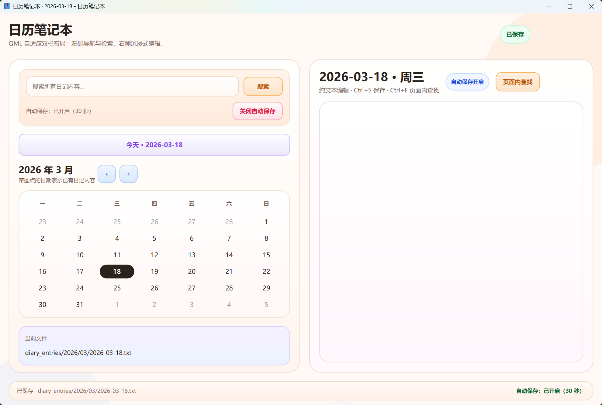

# 日历笔记本 (Calendar Diary)



这是一个基于 **PyQt6 + Qt Quick/QML** 的日历笔记本应用，支持通过日历快速切换日期、编辑纯文本日记，并将内容保存为 UTF-8 文本文件。

## 主要功能

- 响应式双栏 / 单栏主界面
- 日期切换、自动保存、未保存保护
- 全局全文搜索与页面内查找
- 新旧日记目录结构兼容迁移
- **浅色 / 深色模式切换，默认深色模式**

## 运行

```bash
python main.py
```

日记默认保存到：

```text
diary_entries/YYYY/MM/YYYY-MM-DD.txt
```
